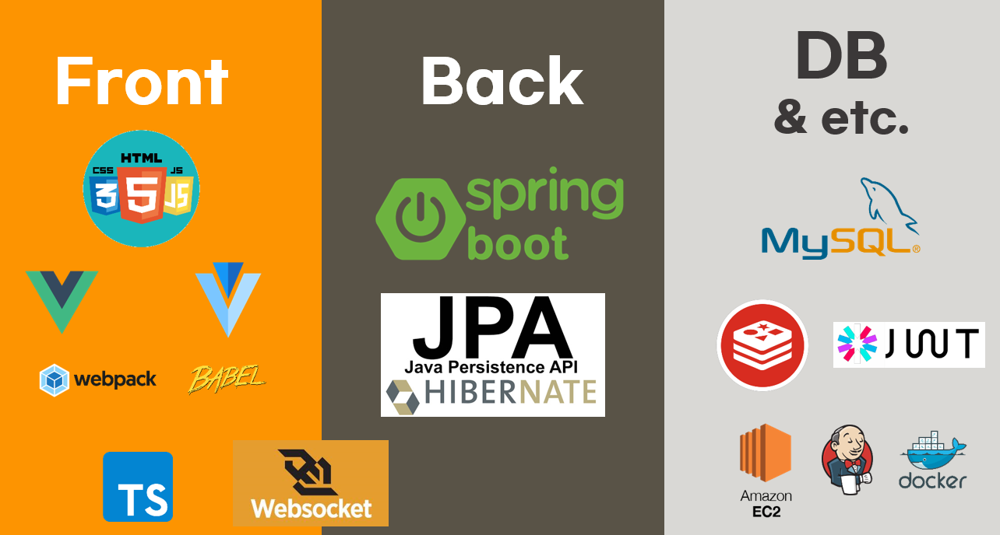
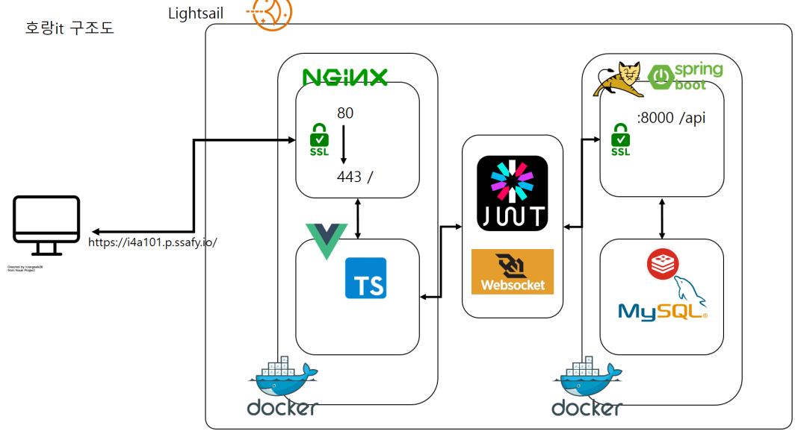
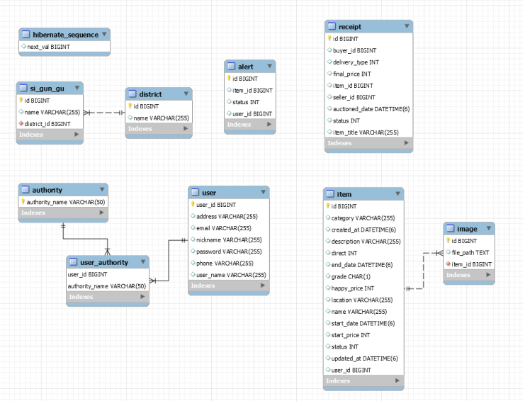

<h2 align="center">호랑IT</h2>

  <p align="center">
    실시간 경매를 도입한 이색 중고거래
    <br />
    <br />
    <a href="https://i4a101.p.ssafy.io"><strong>호랑IT 보러가기</strong></a> |
  	<a href="https://youtu.be/8es-sfv_9KY"><strong>호랑IT UCC</strong></a>
</p>

<br><br>

## 👨‍👩‍👧‍👦 호랑IT 개발진

| ROLE                           | NAME           |
| ------------------------------ | -------------- |
| Captain & Backend & DevOps     | :crown: 송은주 |
| Backend & Presentation & UI/UX | :girl: 이지영  |
| Backend & Security             | :boy: 김성진​   |
| Frontend & DevOps              | :boy: 전원표   |
| Frontend & UI/UX               | :girl: 이승아  |
| Frontend & DevOps              | :boy: 장재용​   |

<br><br>

## :book: 프로젝트 소개


<br><br>

## :sparkles: 기획 의도


2020년 국내 중고거래 시장 규모는 약 20조원 규모로 추산됩니다. MZ세대의 중고거래에 대한 의식이 긍정적으로 변화함에 따라 `호랑IT` 은 이색적인 쇼핑 경험을 제공하고자 합니다.

<br><br>

## :books: 기술 스택



<br><br>

## :hammer: 프로젝트 설계​

#### 전체 구조도




#### ERD 



<br><br>

## :handshake: Develop Rules

#### Branch

```
master -> develop -> feature/기능이름_fe
master -> develop -> feature/기능이름_be
```

#### Commit 메세지

```
[Feat] 새로운 기능에 대한 커밋
[Fix] 버그 수정에 대한 커밋 
[Build] 빌드 관련 파일 수정에 대한 커밋
[Chore] 그 외 자잘한 수정에 대한 커밋
[Ci] CI 관련 설정 수정에 대한 커밋
[Docs] 도큐먼트 수정에 대한 커밋
[Style] 코드 문법 또는 포맷에 대한 수정에 대한 커밋
[Test] 테스트 코드 수정에 대한 커밋
```

#### Merge

```
1. Merge request
2. Review
3. Merge to 'develop' branch
4. Delete 'feature' branch
```

#### Style Guide

- [JAVA & Typescript Guide](https://docs.google.com/document/d/1q-Gd-GeqbXSqx74nl6Mw8N2u2SyrfWfqX-X0Qs_zmxg/edit?usp=sharing)

<br><br>

## 참고

기사 : [MZ세대가 주목하는 '중고거래' ... 가격보다 취향이 우선](https://www.asiae.co.kr/article/2020082919563962172)


