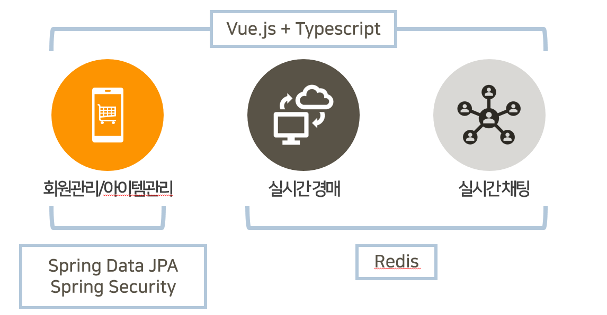

# :tiger: 호랑it

* 실시간 중고경매 서비스

## :star: 참여자

| :books:   | 이름(ㄱㄴㄷ) |
| --------- | ------------ |
| Back-End  | 김성진       |
| Back-End  | 송은주       |
| Front-End | 이승아       |
| Back-End  | 이지영       |
| Front-End | 장재용       |
| Front-End | 전원표       |

---

## :art: 기획의도

* 2020년 기준 국내 중고거래 시장 규모는 약 20조원 규모로 추산
* 중고에 대한 의식의 긍정적 변화
* MZ 세대의 쇼핑 특성이 반영 :arrow_forward: 이색적인 쇼핑 경험을 원함

---

## :sparkles: 서비스 소개

## :books: 기술 스택

## :lock: 현재까지 개발된 기능

:hatched_chick: 회원 가입

:hatched_chick: 로그인

:hatched_chick: 경매 물품 등록

:hatched_chick: 경매 물품 조회

## :unlock: 앞으로 개발해야 할 기능

:hatching_chick: 경매 참여 기능

:hatching_chick: 아이템 필터 등록

:hatching_chick: 페이지네이션 & 정렬

:hatching_chick: 경매낙찰 후 1:1채팅기능

:hatching_chick: ~~외의 더 많은 세세한 것들...~~